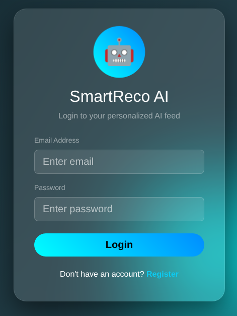
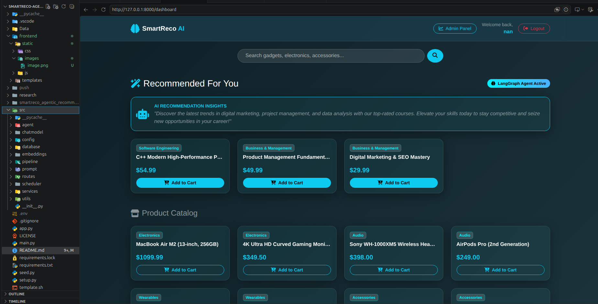
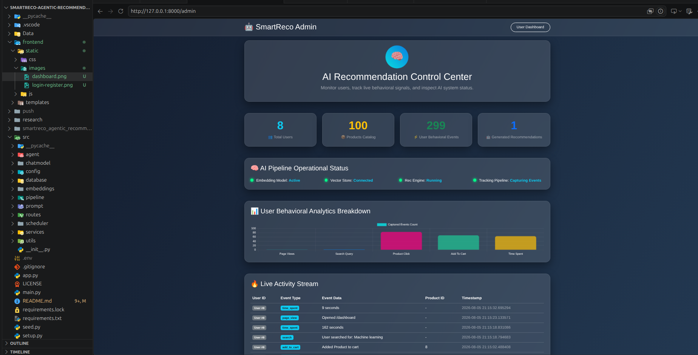

# SmartReco Build Challenge 2026 – AI Behavioral Recommendation Agent

- An Agentic AI-powered recommendation platform that understands user behavior, retrieves the most relevant products using RAG, and generates persuasive personalized recommendations with Mesh API.

- A state-of-the-art, hybrid recommendation platform powered by **FastAPI**, **LangGraph / OpenAI**, **Pinecone Vector DB**, and **SQLAlchemy**. SmartReco bridges traditional behavioral analytics with cutting-edge agentic explicit reasoning to deliver hyper-personalized product recommendations, real-time analytics, and dynamic AI match scores.

---

## 🌟 Highlights & Key Features

* **🤖 Agentic Reasoning Workflow (LangGraph + OpenAI):** Multi-step explicit reasoning pipeline that analyzes recent user interactions and synthesizes personalized, highly persuasive recommendation narratives.
* **🔍 Fast Semantic Search (Pinecone Vector DB):** High-dimensional vector embeddings generated via OpenAI text embeddings to discover latent product similarities beyond keyword matching.
* **⚡ Rule-Based Behavioral Engine:** High-performance, zero-latency heuristic fallback engine (`RecommendationEngine`) that ranks products using weighted event scoring (`search_query`, `add_to_cart`, `product_click`, `view_page`).
* **📊 Live Analytics & Dashboard:** Real-time event tracking and Chart.js integration visualizing user engagement, activity counts, and match confidence scores.
* **🔒 Secure Session Authentication:** Session-based cookie authentication complete with bcrypt password hashing and unauthenticated route protections.
* **🎨 Seamless Jinja2 Frontend:** Clean, responsive UI featuring dynamic match percentage badges (`⚡ AI Match Score: 95%`) and interactive catalog controls.

---


## 📐 Architecture & Recommendation Pipeline

SmartReco utilizes a **3-Tier Hybrid Recommendation Strategy** to balance accuracy, latency, and cost:

```bash
                  ┌─────────────────────────────────────────┐
                  │          Incoming User Request          │
                  └────────────────────┬────────────────────┘
                                       │
                        ┌──────────────┴──────────────┐
                        ▼                             ▼
             [ Cold / New User ]                 [ Active User ]
                        │                             │
                        ▼                             ▼
             ┌─────────────────────┐       ┌─────────────────────┐
             │ Popular Fallback    │       │ 1. Event Analytics  │
             │ Product Engine      │       │    Weighting        │
             └─────────────────────┘       └──────────┬──────────┘
                                                      │
                                   ┌──────────────────┴──────────────────┐
                                   ▼                                     ▼
                        ┌─────────────────────┐               ┌─────────────────────┐
                        │ 2. Semantic Search  │               │ 3. LangGraph Agent  │
                        │    (Pinecone DB)    │               │    (OpenAI Narrative│
                        │    Vector Scores    │               │    & Structured IDs)│
                        └──────────┬──────────┘               └──────────┬──────────┘
                                   │                                     │
                                   └──────────────────┬──────────────────┘
                                                      │
                                                      ▼
                                           ┌─────────────────────┐
                                           │ SQL DB Persistence  │
                                           │ (Recommendation DB) │
                                           └─────────────────────┘
```

1. **Behavioral Weighting:** Aggregates recent activity events with contextual weights (`add_to_cart`: 5x, `search_query`: 3x, `product_click`: 2x, `view_page`: 1x).
2. **Pinecone Vector Search:** Converts activity history into embeddings and queries Pinecone for high-precision mathematical vector similarities.
3. **Agentic Synthesis:** LangGraph agent formulates custom AI narratives explaining *why* specific items were selected.

---

## ⚙️ Installation & Setup

### 1. Clone the Repository

```bash
git clone https://github.com/your-username/smartreco-agentic-recommendation-system.git
cd smartreco-agentic-recommendation-system
```

### 2. Create and Activate Virtual Environment

```bash
# Using Conda
conda create -n ai python=3.10 -y
conda activate ai

# OR using venv
python -m venv venv
source venv/bin/activate  # On Windows: venv\Scripts\activate
```

### 3. Install Dependencies

```bash
pip install -r requirements.txt
```

## Setup Environment

```bash
## Configure Environment Variables

MESH_API_KEY = ""
SUBMISSION_TOKEN = ""

PINECONE_API_KEY = ""
OPENAI_API_KEY = ""

PINECONE_INDEX_NAME = "smartreco-products"
DATABASE_URL = "sqlite:///./Data/smartreco.db"
SECRET_KEY = ""

# LangSmith Observability Tracking
LANGSMITH_TRACING = False
LANGSMITH_ENDPOINT = "https://api.smith.langchain.com"
LANGSMITH_API_KEY = ""
LANGSMITH_PROJECT = "smartreco-build-challenge-2026"


AWS_ACCESS_KEY_ID = ""
AWS_SECRET_ACCESS_KEY = ""
AWS_ECR_LOGIN_URI = ""
ECR_REPOSITORY_NAME = 'rag'
AWS_REGION = "us-east-1"
AWS_DEFAULT_REGION = "us-east-1"
BUCKET_NAME = "rag-model-bucket-2026"
```

### RUN Terminal

```bash
python -m Data.mock_data
## python seed.py ## optional
uvicorn main:app --reload

Access the application in your browser:
* **Web App:** [http://127.0.0.1:8000](http://127.0.0.1:8000)
* **Interactive API Docs (Swagger UI):** [http://127.0.0.1:8000/docs](http://127.0.0.1:8000/docs)

```

## Fronted Demo

### Login OR Register



### User Dashboard



### Admin Panel and Recorad Admin Behavior



## 🗄️ Database Models Overview

* **`User`**: Manages authentication credentials (`email`, `hashed_password`, `full_name`).
* **`Product`**: Catalog store (`title`, `category`, `price`, `description`, `image_url`).
* **`UserActivity`**: Interaction history (`user_id`, `product_id`, `event_type`, `event_data`, `created_at`).
* **`Recommendation`**: Stored outputs (`user_id`, `product_id`, `score`, `algorithm_used`, `created_at`).

### Observability with LangSmith

- Integrated **LangSmith tracing** across all LangGraph reasoning nodes (`analyze_behavior`, `retrieve_products`, `evaluate_and_refine`, `generate_persuasive_narrative`).
- Allows end-to-end inspection of state transitions, vector retrieval quality, and prompt token usage.


## 💻 Tech Stack Summary

* **Backend Framework:** FastAPI
* **Database ORM:** SQLAlchemy (SQLite / PostgreSQL)
* **AI & Agentic Orchestration:** LangGraph, LangChain, OpenAI GPT-4 / GPT-3.5
* **Vector Store:** Pinecone DB
* **Frontend:** Jinja2 Templates, HTML5/CSS3, JavaScript (Fetch API, Chart.js)
* **Security:** Passlib (Bcrypt), HTTP-Only Session Cookies


## AWS-CICD-Deployment-with-Github-Actions

### 1. Login to AWS console

### 2. Create IAM user for deployment

``` bash
# with specific access
1. EC2 access : It is virtual machine

2. ECR: Elastic Container registry to save your docker image in aws

#Description: About the deployment

1. Build docker image of the source code

2. Push your docker image to ECR

3. Launch Your EC2 

4. Pull Your image from ECR in EC2

5. Lauch your docker image in EC2

#Policy:

1. AmazonEC2ContainerRegistryFullAccess

2. AmazonEC2FullAccess
```

### 3. Create ECR repo to store/save docker image

- Save the URI: 520551197421.dkr.ecr.us-east-1.amazonaws.com/smartreco

### 4. Create EC2 machine (Ubuntu)

### 5. Open EC2 and Install docker in EC2 Machine

``` bash

    #optinal

    sudo apt-get update -y

    sudo apt-get upgrade

    #required

    curl -fsSL https://get.docker.com -o get-docker.sh

    sudo sh get-docker.sh

    sudo usermod -aG docker ubuntu

    newgrp docker
```

### 6. Setup github secrets

```bash
AWS_ACCESS_KEY_ID = ""
AWS_SECRET_ACCESS_KEY = ""
AWS_ECR_LOGIN_URI = ""
ECR_REPOSITORY_NAME = 'rag'
AWS_REGION = "us-east-1"
AWS_DEFAULT_REGION = "us-east-1"
BUCKET_NAME = "rag-model-bucket-2026"

```
